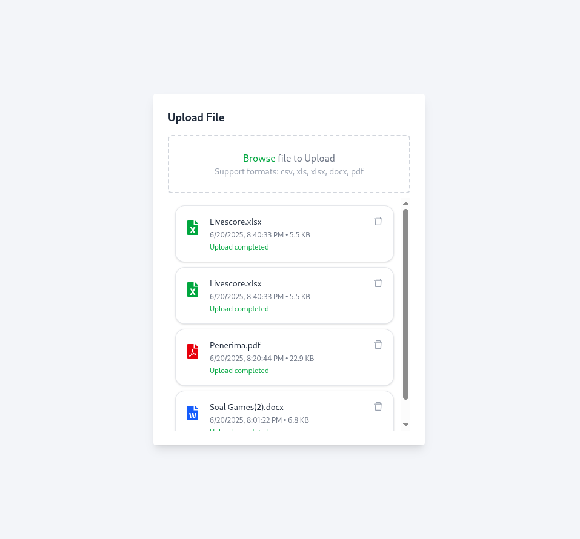

# 📁 Digistar Cloud Class 1 Project




A modular React application built with **Vite** and structured using **Clean Architecture principles**. This app demonstrates a simple file upload UI, organized into `domain`, `application`, `infrastructure`, and `presentation` layers.

---

## 🧱 Folder Structure
```bash
src/
├── domain/
│   └── fileEntity.js
├── application/
│   └── getFileIcon.js
├── infrastructure/
│   └── 
├── presentation/
│   ├── components/
│   │   └── FileItem.js
│   └── pages/
│       └── UploadPage.js
├── App.js
└── main.jsx
```

## 🚀 Features

- 📁 Upload UI for file handling
- 🧼 Clean Architecture separation (Domain, Application, Infrastructure, Presentation)
- ⚡ Built with [Vite](https://vitejs.dev/) for fast dev experience
- 🔧 Easily extendable and maintainable

## ⚙️ Installation

```bash
# Clone the repository
git clone https://github.co🔧 Project Architecture
Domain – Pure business logic (e.g., fileEntity.js)

Application – Use cases (e.g., getFileIcon.js)

Infrastructure – Adapters for APIs, storage (currently empty)

Presentation – Components and pages (FileItem, UploadPage)m/yourusername/vite-react-file-upload.git
cd vite-react-file-upload

# Install dependencies
npm install
```

## 🧪 Run the App
```bash
npm run dev
```

## 🧭 Project Architecture

This project follows the Clean Architecture pattern with a clear separation of concerns:

- 🧠 **Domain** – Business entities and core logic  
  &nbsp;&nbsp;&nbsp;&nbsp;`src/domain/fileEntity.js`

- 🎯 **Application** – Use cases that implement business rules  
  &nbsp;&nbsp;&nbsp;&nbsp;`src/application/getFileIcon.js`

- 🌐 **Infrastructure** – External dependencies and integrations (e.g., APIs, storage)  
  &nbsp;&nbsp;&nbsp;&nbsp;`src/infrastructure/`

- 🎨 **Presentation** – UI layer with components and pages  
  &nbsp;&nbsp;&nbsp;&nbsp;`src/presentation/components/FileItem.js`  
  &nbsp;&nbsp;&nbsp;&nbsp;`src/presentation/pages/UploadPage.js`

- 🏁 **Entry Point** – Root setup for the React application  
  &nbsp;&nbsp;&nbsp;&nbsp;`App.js`, `main.jsx`

## ✍️ Author

Built by True Krishna
